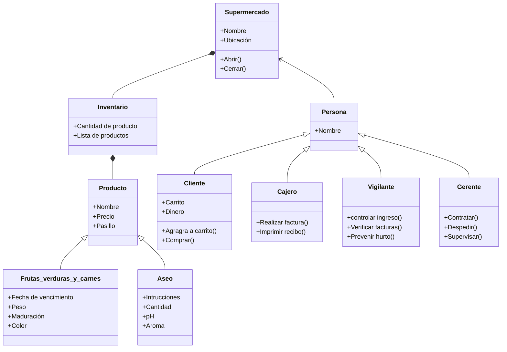

# Reto 2 Dilan Porras

```mermaid
classDiagram
    Supermercado *-- Inventario
    Supermercado <-- Persona
    Supermercado : +Nombre
    Supermercado : +Ubicación
    Supermercado: +Abrir()
    Supermercado: +Cerrar()
    Inventario *-- Producto
    Producto <|-- Frutas_verduras_y_carnes
    Producto <|-- Aseo
    Persona <|-- Cliente
    Persona <|-- Cajero
    Persona <|-- Vigilante
    Persona <|-- Gerente
    class Inventario{
        +Cantidad de producto
        +Lista de productos
    }
    class Producto{
      +Nombre
      +Precio
      +Pasillo
    }
    class Aseo{
        +Intrucciones
        +Cantidad
        +pH
        +Aroma
    }
    class Frutas_verduras_y_carnes{
        +Fecha de vencimiento
        +Peso
        +Maduración
        +Color
    }
    class Persona{
      +Nombre
    }
    class Cliente{
        +Carrito
        +Dinero
        +Agragra a carrito()
        +Comprar()
    }
    class Cajero{
        +Realizar factura()
        +Imprimir recibo()
    }
    class Vigilante{
        +controlar ingreso()
        +Verificar facturas()
        +Prevenir hurto()

    }
    class Gerente{
        +Contratar()
        +Despedir()
        +Supervisar()
    }
```
